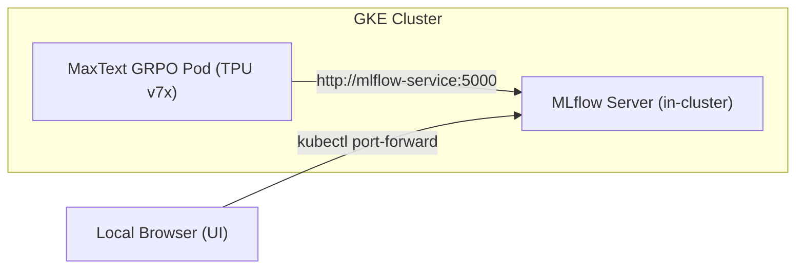

# MLflow Tracking & Metrics Export Guide for MaxText GRPO

This guide explains how to set up an **MLflow Tracking Server** and stream real-time metrics (loss, rewards, TFLOPs, step times) from **MaxText GRPO RL post-training workloads** on Google Cloud TPUs.

---

## Workflow Overview

Setting up MLflow tracking consists of two steps:
1. **Step 1: MLflow Server Setup** (Deploy inside GKE or connect to an existing external server).
2. **Step 2: MaxText Metrics Export** (Use the zero-code launcher wrapper or direct source patch).



---

## Step 1: Set Up Your MLflow Tracking Server

Choose one of the two server setups below:

### Setup A: Deploy In-Cluster MLflow on GKE (Recommended — Zero Network Friction)
If you don't already have an external MLflow server or if VPC firewalls restrict external egress from TPU nodes, deploy MLflow directly inside your GKE cluster:

1. **Apply the MLflow manifest**:
   ```bash
   kubectl apply -f training-grpo/mlflow-in-cluster.yaml
   ```

2. **Verify the server is running**:
   ```bash
   kubectl get pods,svc -l app=mlflow
   ```
   *Tracking URI for your training pods*: `http://mlflow-service:5000`

---

### Setup B: Use an Existing External MLflow Server
If your team already maintains a central MLflow server (e.g. on Cloud Run, a Compute Engine VM, or a managed host):

1. Ensure the GKE Pod CIDR range (e.g. `10.4.0.0/14`) is permitted through the target server's GCP firewall on port `5000`.
2. *Tracking URI for your training pods*: `http://<EXTERNAL_IP_OR_HOSTNAME>:5000`

---

## Step 2: Export Metrics from MaxText GRPO to MLflow

Choose between the recommended zero-code wrapper or direct source patch:

### Method A: Launcher Wrapper via TensorBoard Autolog (Recommended — 0 MaxText Edits)

Because MaxText natively writes rich scalar metrics to TensorBoard, MLflow's `mlflow.tensorboard.autolog()` intercepts and mirrors all metrics to MLflow in real time without modifying any MaxText code.

#### 1. The Launcher Script ([`train_with_mlflow.py`](file:///Users/pmotgi/exploration/cerence/training-grpo/train_with_mlflow.py))

```python
"""MLflow TensorBoard Autolog Launcher for MaxText GRPO."""
import os
import sys
from absl import app
import mlflow

# 1. Point to MLflow Tracking Server
tracking_uri = os.getenv("MLFLOW_TRACKING_URI", "http://mlflow-service:5000")
experiment_name = os.getenv("MLFLOW_EXPERIMENT_NAME", "maxtext-grpo-training")

mlflow.set_tracking_uri(tracking_uri)
mlflow.set_experiment(experiment_name)

# 2. Enable Real-Time TensorBoard Auto-Logging
mlflow.tensorboard.autolog()

# 3. Launch MaxText RL Engine
from maxtext.trainers.post_train.rl.train_rl import main

if __name__ == "__main__":
    app.run(main)
```

#### 2. Update the JobSet Manifest ([`llama3.1-8b-grpo-dws-2x2x1-training.yaml`](file:///Users/pmotgi/exploration/cerence/training-grpo/llama3.1-8b-grpo-dws-2x2x1-training.yaml))

```yaml
            env:
            - name: MLFLOW_TRACKING_URI
              value: "http://mlflow-service:5000"       # In-cluster or external URI
            - name: MLFLOW_EXPERIMENT_NAME
              value: "llama3-1-8b-grpo-training"
            command:
            - python3
            - /checkpoint/train_with_mlflow.py         # <-- Use the launcher script
            - maxtext/configs/post_train/rl.yml
            - model_name=llama3.1-8b-Instruct
            - tokenizer_path=meta-llama/Llama-3.1-8B-Instruct
            - run_name=llama3-1-8b-grpo-training-run
            - base_output_directory=/checkpoint/maxtext
            - chips_per_vm=4
```

---

### Method B: Direct Source Patch in `metric_logger.py` (Alternative)

If you prefer modifying MaxText source code directly, add the following hooks into [`src/maxtext/common/metric_logger.py`](file:///Users/pmotgi/exploration/cerence/maxtext/src/maxtext/common/metric_logger.py):

#### 1. In `MetricLogger.__init__`:
```python
    self.enable_mlflow = getattr(config, "enable_mlflow", False) or bool(os.getenv("MLFLOW_TRACKING_URI"))
    if self.enable_mlflow and jax.process_index() == 0:
      import mlflow
      mlflow_uri = getattr(config, "mlflow_tracking_uri", "") or os.getenv("MLFLOW_TRACKING_URI")
      if mlflow_uri:
        mlflow.set_tracking_uri(mlflow_uri)
      experiment_name = getattr(config, "mlflow_experiment_name", "") or os.getenv("MLFLOW_EXPERIMENT_NAME", "maxtext")
      mlflow.set_experiment(experiment_name)
      mlflow.start_run(run_name=config.run_name)
```

#### 2. In `MetricLogger.write_metrics`:
```python
      if self.enable_mlflow and jax.process_index() == 0:
        self.write_metrics_to_mlflow(metrics, step)
```

#### 3. Add `write_metrics_to_mlflow` Helper:
```python
  def write_metrics_to_mlflow(self, metrics, step):
    """Logs scalar metrics directly to MLflow."""
    import mlflow
    flat_metrics = {}
    for key, val in metrics.get("scalar", {}).items():
      flat_metrics[key] = float(val)
    for key, val in metrics.get("scalars", {}).items():
      for subkey, subval in val.items():
        flat_metrics[f"{key}/{subkey}"] = float(subval)
    mlflow.log_metrics(flat_metrics, step=int(step))
```

#### 4. In `MetricLogger.flush_metrics_and_cleanup`:
```python
    if self.enable_mlflow and jax.process_index() == 0:
      import mlflow
      mlflow.end_run()
```

---

## Step 3: Access the MLflow Web UI

If using in-cluster MLflow, forward the port to your local machine:

```bash
kubectl port-forward svc/mlflow-service 5000:5000
```

Open **`http://localhost:5000`** in your browser.

---

## Exported Metrics Reference Table

| Category | Metric Key | Description |
| :--- | :--- | :--- |
| **Training Loss** | `learning/loss` | Total training loss per optimization step |
| **Learning Rate** | `learning/current_learning_rate` | Warmup/cosine scheduled learning rate |
| **Gradients** | `learning/grad_norm` | Global gradient norm |
| **Reward: Exact Match** | `rewards/exact_match` | Accuracy score of extracted model answers |
| **Reward: Formatting** | `rewards/format` | Adherence score to `<reasoning>` & `<answer>` tags |
| **Hardware Throughput** | `perf/per_device_tflops_per_sec` | Actual TFLOP/s achieved per TPU device |
| **Token Throughput** | `perf/per_device_tokens_per_sec` | Processed training tokens per second per device |
| **Step Time** | `perf/step_time_seconds` | Elapsed duration per training step in seconds |
